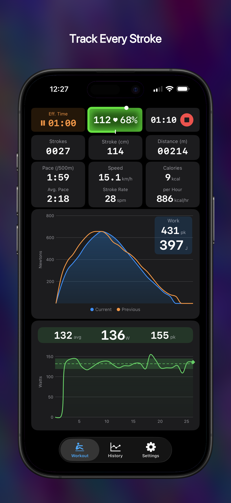
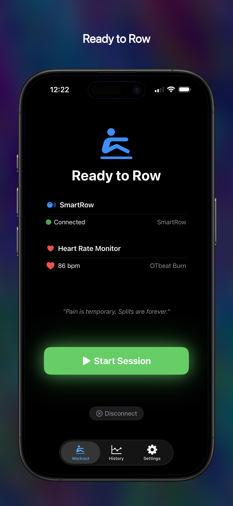
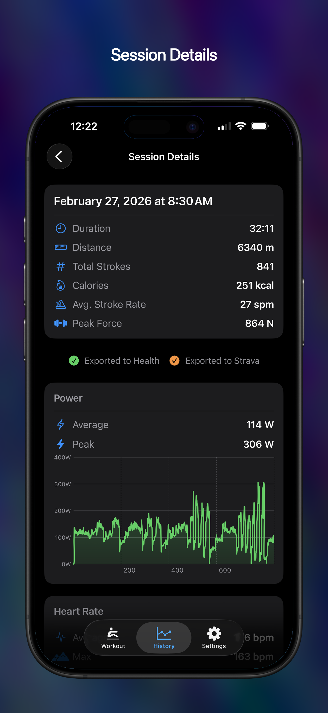

# SmartRow Companion

An iOS companion app for the [SmartRow](https://www.smartrow.fit/) rowing sensor. Connect via Bluetooth to see real-time rowing metrics, force curves, and power data on your iPhone or iPad.

  

  
  
  

## Features

* **iCloud sync** — Rowing sessions automatically sync across devices via iCloud
* **Real-time metrics** — Pace, avg. pace, speed, stroke rate, calories, and calories per hour updated every stroke
* **Live force curve** — See your drive force profile in real time with smooth morphing between strokes and optional previous-stroke overlay for technique comparison
* **Power graph** — Track power output across your session with average power reference line and rolling window mode
* **Peak tracking** — Peak power, peak work, and peak pace highlighted with a flash when new session highs are reached
* **Power consistency feedback** — Percentage deviation display when your power drifts outside a configurable tolerance band, with optional audio chime
* **Audio chimes** — Configurable sound effects for distance milestones, new peak achievements, and power consistency threshold crossings
* **Drive phase animation** — Blue sweep animation on the stroke length chip during each drive so you can see your stroke rhythm at a glance
* **Distance milestones** — Full-screen flash at configurable distance intervals to mark your progress
* **Heart rate zones** — 5-zone heart rate model with zone-colored display and animated progress ring showing percentage of max HR; configurable max HR from age or manual entry
* **Heart rate monitor support** — Pair any Bluetooth heart rate strap; displayed during workouts with zone coloring and included in exports
* **Session history** — Browse past sessions with detailed power, pace, heart rate, and distance graphs
* **Strava integration** — Auto-upload completed sessions as Indoor Rowing with full power, distance, and heart rate data
* **Apple Health export** — Auto-save workouts to Apple Health
* **Works on all iPhones and iPads** — Scales cleanly on all screen sizes including Display Zoom and Bold Text

## Support

If you have a question, found a bug, or want to request a feature, please [open an issue](https://github.com/gburlingame/smartrow-app/issues) on GitHub.

## Links

* [Privacy Policy](privacy)
